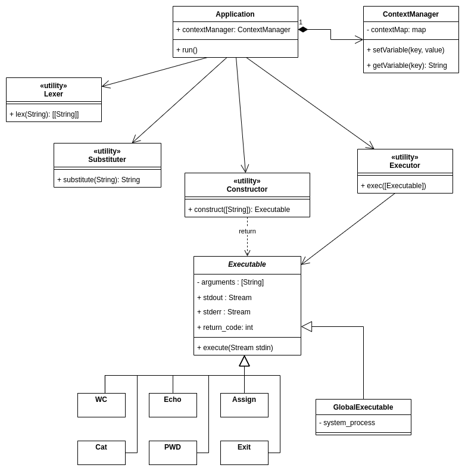

# Практика 1: задача про CLI

# Описание архитектуры

[UML class diagram](https://viewer.diagrams.net/?tags=%7B%7D&highlight=0000ff&layers=1&nav=1&title=cli-class_scheme.drawio#R7V1bc9o4FP41mck%2B0MFXyCOXpN2ddJfdZLfbvmQEVkBbY1FbTqC%2FfiVbMliWwRAbQ%2FBMp8XHQtj6vnPR0ZF6ZQzmy48%2BWMw%2BYwe6V3rbWV4ZwytdNzWD%2Fs0Eq1jQ0cxYMPWRE4u0teAB%2FYRc2ObSEDkwSDUkGLsELdLCCfY8OCEpGfB9%2FJpu9ozd9K8uwBRmBA8T4GalX5BDZrG0a7XX8k8QTWfil7U2vzMGk%2B9TH4ce%2Fz0PezC%2BMweiG940mAEHv26IjNsrY%2BBjTOJP8%2BUAumxUxYjF37vLuZs8sg89UuQLo%2BDp9vNs%2BOs33PvRab08%2FB7Cx5YV9%2FIC3JAPxQB7BC7JZ%2BDRl%2Fb5o5OVGKngFc1dQF%2FS6D%2FTlg%2F8jkavgYumHv08oQ9Ev2n0X6BPEB3kHr9B8IJKJzPkOvdghUP22AGhIyiu%2BjPso5%2B0W%2BDyPultn3C%2B6HaqxQP7JhW3qdSHAW0zEmOhSaLPYJlqeA8CwgUT7LpgEaBx8hpz4E%2BR18eE4DlvlB1qPvrsDeFyQ8SH%2FiPEc0j8FW3C79ompwHXEE3Q4nXNN83mslmKazrnOef4NOl7DTb9wPHeA3s7g30rVrEYf4pVL%2BLxIkMC1iACx8ff4QC7mKI9jKhPWYFcVxIJYrjwmeTSIliACfKm91GbobmW%2FMXHgokw%2Fe6zG2nRDDkO9BikmAACYvwYWAuMPBKNldWnf%2BiQDtofrCuLPviAXmvra%2FqHNfcJ5Tx9F4AidCElxytkBFHgvlWJdpOBg6%2FbxbAX7UqHvpOBPoOxiyLsYoyFUdQOAnhOoXLhGtFHBviwpWVQN7KoGwqEXTCG7ggHiCDM%2BvfjthLyu8BNsxd5M%2BijKkG39GKgdyvCvKvAvM8wh%2BQf4CM2vtff4YppCW%2F1S6P4JXPALmj0K1P8mxwSTNMk%2BCW2%2FQ%2FEpzg0LCiZBd26zb8Iuzdo0FssXIpKZFGbmK%2BcmM%2FQd8d8yRQo5QIqA17LAB%2Fr%2FyQd9Ufav2Mm0FgBtU69JQpUsqE6M6A3YeBbw8D9YVfEgWojUBXqRo4N8EPvugn5SsdbEfMdWc3NLOAD%2FarXDwlyEVmxiz59f%2Fr7hsZG9R4uTyvzY7bPOAqQEj%2FJ9a7or2NWxYds4qcx%2B%2FuafbMwDVZpGtQ1%2FddUOR9m9l24vI4nenzWF9tSPveLTWfjFMpmQ7cYG6pzCop00Fan8BCOA4JISBrXUJpr0KQJomEpjET3mL5Bz2YGGt%2Bwr2%2FoFubBFt%2Bggr0q36DnpQWCROnTLqJJDFZEBIVbUBGhMrcg1L2wW6C2NGg8QnkpQzvtEcy2wjR0juoRFLPHxiPs5xESrXqTR1DBXplHyBaGxB5hwfT9enN%2BwF3C7RJOwnjkG7dQNhsUbkHFhurcQjZlsAXvHONvHMH4G2dt%2FC0rZfytonGhZlcFvJGNB1iREH39cA6Z3tAJg0garDMGjQHYbgDswswQE8OCRCjDAPyn6U9IHw3%2B%2BHP4OLp7vB39NvzWylszCIjDtFKwgFIAgvmF45%2BBtTAl8teMFBUDSvxLiAL%2FXiIw9sL72afesGt1vj49%2F%2FBbuRNE4kDfb%2FCvWP%2B7det%2FHv4%2BJKHvPU2wA2MGsDG5bPgrUH%2BtXVT%2FKwsAVdWDzSxwv1ng3mqvifCrtsRgXr0gjKL%2FKCsYGXzmCJDXVA%2BUT4Gic4DKVN9QLRfbbqQ%2BKbDtHyHby8InR9QdtBfL5LIVYdczIxFjRYtj3Uumguse6Kcp%2Fzf6nbEQfBkIEX2VsdyMyhZrmcRENZckwm2whrFTTGDjuaWm8%2Bs7MEcuw%2BcTdF8g65VNOslcTEhLmApqUh6w08nSQMUCwZbyWaBaPq6JBbeTGb4QHiQgnwwPVIFATTwYAHIhNJDNQVexUHxcGqgCg5poMPoyvBAayNagdhqYqnlhXV5hiS7FHCSrgifDg2yauDYe9IKAfekymVB7fGBmM8UfXTwG7v7rRc3%2Boh3gW%2FIkQZUmVFUV2pWhny0WYMtFwSogcP608PEEBkEG%2FyZJoFah89lPbqrKBZr04F7pwf1hr3tHuaVaFZRQh57TYwe00Kuxi5lx7VOR8JR2fHkX%2BdAIig33mB5PBz6DMHLfkAZ6%2F7LmH6yOya%2B%2FMvzbH9ptgwuGwjpHF6uNixGFhb4%2F8yax%2BWant0BHtHCmUDggivUMT7FHnddamm%2B4Axz6E7hlvEQmjfqfKSySJmQPs5UIKuR96AKCXmDq2VTY8%2B5GOFqzSaaaNzlORXQRvyb%2F1ppBmY6SYua8juJhyHRE6QJWG824EuY%2BsC4WR8TvmO2tz2VKG3Kk9vRD%2FARrvUgG%2FA2qUqCKrgJVOSK3u2fAbV2TqHIot02Z20ZF3JbzPp3t3Jbbn6YuFAgWzlsXOuegC7qkCzeH2nk5RW1KRSgl6YJ8msJpcrvA3srz5vbNOXDbSHO72z6U23IwZFXEbTmxu8POZ3XuFHWhwCljZ60LIut52rpgSrqgHRrzyKlGuxpdyHDV2JPbxjG4XaAe6ry5LY5hPWluWxK39UO5rUkckrdTlcRtS1642WHn5fanaedVa8HvSheMc9AFW9IFeUpaWBfkOLtbjS7IJ%2BLa3KaWxVVlHbueperW7a3xqhVlnkzoZoPrJk33OAfZSKNuFD0Ss4wNrkpKNPtb91m62KpVp3gYjvKB83a3srJmtrl1Y7GabXCV%2BXC5C5YlwX%2FE02%2BUT7xf9I4X0UCvIxQtHb7o6YAlHZgcHnZoRcMOcfxQHWGHIdlz8%2BAQ%2FGZHRzlhR1mRwX5B7AlRYptKngIjdM06jBG6SCSLjqzjMkJxSvKZUGLrsQN1cMIUG5kSTtiHccLU0x0ZBRfeSuNEtuBVK0CKDdwlRkSBvWjtIDDHnvM4Y6WRqZhfM4Vgk1w757w7Io8xD%2B7luTQvsNA2iitYyLCtsuINBC6aabIK8pdTRexZFUxp3F2KyIqZ8BkbN3HUVi3Gzbwpx7iJDEjCCTlVXzUnsvVc8f7uDDM2oM61KVn2OCCYRaRIk6crmTLojvHrphWLBPSG%2BCmWrgj9l4RfZbFNHHpUXp7vrcySykyMg9foOzs6qppZ%2B5U%2FVW9ttmUFTjrN%2B36MTT2rw03xaKWLEHItZufQ8EheyJJp%2Fk6LR9Wq8t4X2M6iYC5Tf3bq3K65YI5erv9z07j5%2Bv%2BONW7%2FBw%3D%3D)

#### Точкой входа в программу является метод `run` класса `Application`.

### Application

У объекта данного класса есть поле `contextManager`, метод `run`.

В `contextManager` сохраняются переменные окружения, добавленные пользователем во время сеанса использования программы.
В методе `run` поспедовательно выполняются следующие действия:

1. Чтение входных данных до символа переноса строки.

2. `(Фаза 2)` Разбиение входной строки по символам | ( `pipeline` ). Получение массива строк.

4. Подстановка переменных из контекста приложения в каждую из полученных строк с помощью `Substituter`.

5. Разбиение строк на лексемы с помощью `Lexer`. Если ввод не пустой и `Lexer` успешно обработал строки, то результат передается в `Constructor` , иначе пользователю сообщается об ошибке и выполняется переход к пункту 1.

6. Создание экземпляров класса `Executable` с помощью класса `Constructor`.

7. Последовательное исполнение экземпляров `Executable` с помощью `Executor`. Происходит передача вывода предыдущих экземпляров `Executable` на ввод последующим.

8. В случае успешного завершения всех `Executable` производится вывод пользователю результата последнего экземпляра `Executable`. В случае возникновения ошибки во время исполнения одного из `Executable` выполнение прекращается и выводится информации об ошибке.

9. В случае выполнения команды `exit` работа приложения завершается.

## Обработка ввода

В данном разделе будет описана специфика работы классов и методов, отвечающих за обработку ввода.

### Substitution (+ Context variables) `(Фаза 2)`

Класс `ContextManager` отвечает за хранение пользовательских переменных.
Пользовательской переменной называется символическое имя, состоящие из букв, цифр и знака `_`, которой соответствует некоторая строка.

Класс `Substitution` имеет метод `substitute`, принимающий строку и выполняющий подстановку следующим образом:

1. Осуществляется линейный проход по строке.
2. Если встретилась одинарная или двойная кавычка и стек кавычек пуст, то кавычка добаляется в стек.
3. Если встретилась одинарная или двойная кавычка и в вершине стека лежит такая же кавычка, то кавычка удаляется из текущей позиции строки и из того места, откуда была добавлена в стек кавычка; кавычка удаляется из стека.
2. Если встречается символ `$` и в стеке нет одинарных кавычек, то находится самая длинная подстрока из букв, цифр и знаков `_` , начинающаяся после `$` - имя пользовательской переменной.
3. Производится замена символа `$` и имени переменной на значение из контекста приложения.
4. Продолжается проход по строке со следующей позиции.

Если в стеке осталась кавычка, то выбрасывается ошибка подстановки.

### Lexer

Данный класс содержит метод `lex`, принимающий строку и разбивающий ее на массивы лексемы следующим образом.

1. Строка разделяется по пробельным символам.
2. Если в строке есть символ `=`, то строка разделяется по этому символу, причем сам символ `=` тоже выделяется в отдельную лексему.

### Constructor

Данный класс имеет метод `construct`, принимающий список лексем и конструирующий из него объекты класса `Executable`.

1. Если вторая лексема **соответствует** символу `=`, то создается соответствующий наследник класса `Executable` отвечающий за добавление или изменения пользовательских переменных. Остальные лексемы передаются в качестве аргументов.
1. Если первая лексема **соответствует** названию встроенной команды, то создается соответствующий наследник класса `Executable`. Остальные лексемы передаются в качестве аргументов.
2. Если первая лексема **не** **соответствует** названию встроенной команды, то создается наследник класса `Executable`, позволяющий сделать системный вызов этой команды. Остальные лексемы передаются в качестве аргументов.

## Исполнение команд

### Executor

Данный класс имеет метод `exec`, принимающий список объектов класса `Executable` и последовательно выполняющий их, передавая выходный поток очередного объекта класса `Executable` следующему объекту в входной поток.  В случае возникновения ошибки во время исполнения одного из `Executable` выполнение последующих не производится и пользователю выводится информации об ошибке. Если ошибок не произошло, то вывод последнего `Executable` передается пользователю.

### Executable

Объекты данного класса имеет метод `execute`, принимающий стандартный поток ввода и выполняющий соответствующую команду. Также они содержат следующие поля:

> `arguments: [String]` - содержит список аргументов команды

> `stdout: Stream` - поток вывода команды

> `stderr: Stream` - поток ошибок команды

> `return_code: int` - код возврата команды

#### Встроенные команды

В данном разделе описаны представители класса `Executable`, реализованные в приложении.

`cat [FILE]`  — вывести в поток выводы содержимое файла.

`echo [FILE]` — вывести на экран свой аргумент (или аргументы).

`wc [FILE]` — вывести количество строк, слов и байт в файле.

`pwd` — вывести текущую директорию.

`=` - инфиксная команда, которая добавляет в контекст пользовательскую переменную с именем предыдущей лексемы и значением последующей.

`exit` — выйти из интерпретатора.

#### Внешние команды

Класс `GlobalExecutable` отвечает за вызов команд, которые не предусмотрены в данном приложении.
